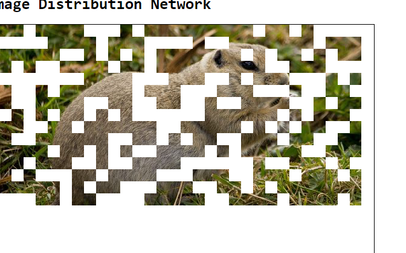
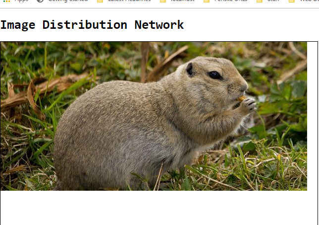

# golang tour
Go files and solutions to Russ Cox 2010 course. Good course to learn various aspects of Go.

I have include the course pdf (go-course.pdf) in this repo. In this pdf you can find the link for the support code for these exercises, but this course is from 2010 and some code did not compile with recent Go version. Like http handler function definition took pointer to http.Conn object instead of http.ResponseWriter.
I changed those code and included in this repo. So its best to work with code included in this repo. 
These exercises were fun and lot of learning. You should try to implement these first by yourself. 
Please send your feedback if anything can be improved.


## Disclaimer
Only main.go and code in tour/distributed folder contains my code. main.go is the solutions for the exercises and tour/distributed contains the code for the Master node (RPC exercises). Code for Master node were not included in original support code.

Code in main.go is listed in the same order as the below exercises have been mentioned, so that it is easy to follow the solutions.

## Build instructions
Pre-requisites: You should have Go installed and GOPATH environment variable set. Your PATH environment variable should be set to look into GOPATH/bin folder
#### For linux

```sh
$ cd $GOPATH/src
$ git clone https://github.com/yogisinha/tour.git
$ cd tour
$ go install
```

It will put the "tour" binary in your $GOPATH/bin directory

#### For Windows

```sh
$ cd %GOPATH%\src
$ git clone https://github.com/yogisinha/tour.git
$ cd tour
$ go install
```

It will put the "tour" binary in your %GOPATH%\bin directory

You can execute below command to see all the command line flags
```sh
tour -help
```

## Things to Note
Most of the following exercises runs a server at port 4000. If you have to change that on your machine replace that 
port number with your port number in following instructions. You can end the server by pressing Ctrl+C to end each exercise.

Following is the list of exercises and how to run them:

### Nuts and Bolts

#### Square root
-sqrt option accepts the number for which square root to be printed
```sh
tour -sqrt=66
```
#### WordCount
-wcf option runs the WordCount exercise. Run the binary with following option:
```sh
tour -wcf
```
Now go to http://localhost:4000 in your browser and start typing in the text-area. It will print the words and their ocurrences interactively.

#### Slices
-slices options runs the Slices exercise which accepts some drawing functions. It displays the slice data interpreted as grayscale pixel values. Those functions produces some art. Run the binary with following option:
```sh
tour -slices="X+Y"
```
Now go to http://localhost:4000 in your browser and you will see some art. Possible values for this option is 
1. "X+Y"
2. "X*Y"
3. "(X+Y)/2"
4. "X^Y"

### Interfaces and Web Servers

#### Hello World 2.0
-helloworld2 option runs the Hello World 2 exercise. Run the binary with following option:
```sh
tour -helloworld2
```
Now go to http://localhost:4000 with request parameter "name" (http://localhost:4000?name=Gopher) and it will respond with "Hello, *name*" (Hello, Gopher)

#### Methods
-methods option runs the Methods exercise. Run the binary with following option:
```sh
tour -methods
```
It just shows how to expose a type as a server by implementing ServeHTTP method on those types.
Go to http://localhost:4000/string and http://localhost:4000/struct in your browser.

#### Image Viewer
-imgver option runs the Image Viewer exercise. It is the same concept as Slices exercise but instead of 
returning [][]unit8 slices, it returns image.Image type which then displayed on browser. Run the binary with following option:
```sh
tour -imgvwer="X+Y"
```
Go to http://localhost:4000 in your browser and you will see some art. Possible values for this option is
same as in Slices exercise.  Look at these Go blog links about how Go represents the images before implementing this exercise
1. https://blog.golang.org/go-image-package
2. https://blog.golang.org/go-imagedraw-package
3. https://golang.org/pkg/image/draw/


#### PNG Encoding 
-pngencode option runs the PNG Encoding exercise. Run the binary with following option:
```sh
tour -pngencode
```
It shows how to define your own image type and expose it as a http end point by implementing ServeHTTP method on it.
You can specify width and height parameter as request parameters. for e.g. Go to http://localhost:4000?x=200&y=200 and it will produce
png image of that size. Currently, it just implments one function to produce the pixel colors. More functions as in Slices
exercise can be implemented.

#### Mandelbrot Set Viewer
-mandelbrot option runs the Mandelbrot Set Viewer exercise. Run the binary with following option:
```sh
tour -mandelbrot
```
Go to http://localhost:4000 and it will generate Mandelbrot image on the browser. You can pan in the viewer
by dragging with the mouse and zoom by using the scroll wheel or by clicking + and −
In main.go, in method mandelbrotColor, you can experiment with different colour schemes by uncommenting code.
This can be done as exercise to take different color schemes as command line option.

#### Julia Set Viewer
-julia option runs the Julia Set Viewer exercise. Run the binary with following option:
```sh
tour -julia
```
Go to http://localhost:4000/juliaviewer and it will generate Julia set image on the browser. You can pan in the viewer
by dragging with the mouse and zoom by using the scroll wheel or by clicking + and −

### Concurrency and Channels

#### Equivalent Binary Trees
It is implemented in "func Same(t1, t2 *tree.Tree) bool" function to check whether 2 Binary search Trees are equivalent or not.
This exercise demonstrates the use of goroutines and channels.

#### Web Logging
-weblog option runs the Web Logging exercise. Run the binary with following option:
```sh
tour -weblog
```
It sends an infinite sequence (say, 1, 2, 3, 4, 5, ...; ) of Log messages on browser, sleeping for a second
after each send. Go to http://localhost:4000/ and you should see the log messages. 

#### Chat Room
-chatex option runs all the Chat related exercises (Chat Room, User Lists, Julia Set Bot). Run the binary with following option:
```sh
tour -chatex
```
Open two or more browser windows on http://localhost:4000 and you can 
1. Join the chat and send messages from one browser window to another. Messages will be broadcasted to all the windows.
2. When a user joins (or exits), a message will be displayed with a list of all the users, formatted like:
[+newUser, oldUser1, oldUser2]
[−userWhoLeft, remainingUser1, remainingUser2]
3. For the julia bot - This feature respond with a julia image for messages like julia: 0.285+0.01i

### Networking with RPCs

#### File downloads
Exercises under this topic was mainly about building a distributed file download like system. 
This exercise will stream the images in small fragments to your browser either in sequential 
or distributed fashion.

This exercise mainly starts with -rpc option:
```sh
tour -rpc -image=<some image path> -x=<number> -y=<number> -random 
```
Below is the description of options to run this exercise:
1. -image : accepts the image path on your system. Note: Include path in double quotes if your image path contains spaces.
2. -x and -y : accepts width and height of block which the program will take and break the image in blocks of those 
dimension and send it to browser. (default for x and y is 50 and 50)
3. -random : whether to send the image blocks in random order or not (default is false)
4. -mode : sequential or distributed. In sequential, image blocks are sent by only one goroutine. In distributed, image 
blocks are distributed among multiple goroutines listening on tcp connections and each goroutine is responsible for 
certain no of blocks. Possible values for this flag is s and d. (default is s (sequential))
5. -workers : No of workers in distributed mode. This is only meaningful when the -mode is "d". (default for this option is 5)

##### Below are various runs of -rpc option 
You can use the image (gopher-619x300.jpg) provided in this repo to run the following commands
```sh
tour -rpc -image=gopher-619x300.jpg
```
Go to http://localhost:4000/ and you will see the image gets built on the browser in blocks of 50x50 and image
blocks come in sequentially.

```sh
tour -rpc -image=/home/go/Pictures/gopher-619x300.jpg -x=20 -y=20
```
Go to http://localhost:4000/ and you will see the image gets built on the browser in blocks of 20x20 and image
blocks come in sequentially.

```sh
tour -rpc -image=/home/go/Pictures/gopher-619x300.jpg -x=20 -y=20 -random
```
Go to http://localhost:4000/ and you will see the image gets built on the browser in blocks of 20x20 and image
blocks come in randomly. 

Below is the screenshot of how the image blocks appear in random order and then next is of completion of image construction.
Same effect you will see when the program runs in distributed mode.






```sh
tour -rpc -image=/home/go/Pictures/gopher-619x300.jpg -x=30 -y=30 -mode=d -workers=10
```
Go to http://localhost:4000/ and you will see the image gets built on the browser in blocks of 30x30 but now in this 
case, a Master node assigns image blocks to workers in random fashion and they co-ordinate with other workers and send the image fragments
to browser. In the end of run, program stops the Master and all the worker processes.
